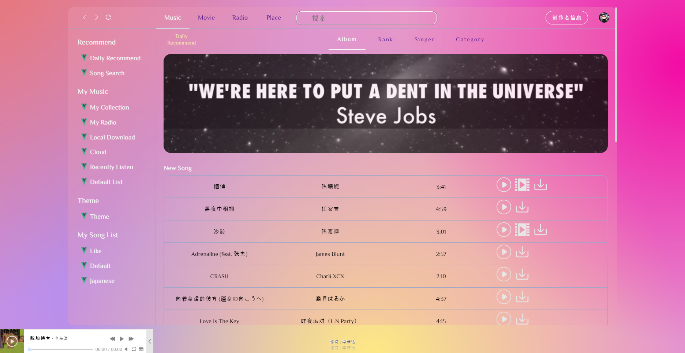
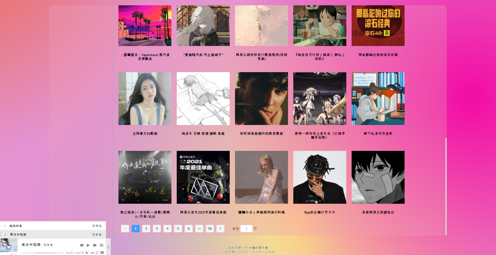

# cloud_music_vue2

## 安装

```
git clone -b master git@github.com:Esdiarap/CloudMusic.git
```

```
git clone git@github.com:Binaryify/NeteaseCloudMusicApi.git
```

## 项目设置

```
yarn
cd .\NeteaseCloudMusicApi\
yarn
```

### 运行

```
cd .\NeteaseCloudMusicApi\
node .\app.js
cd ../
npm run serve
```

## 项目预览



